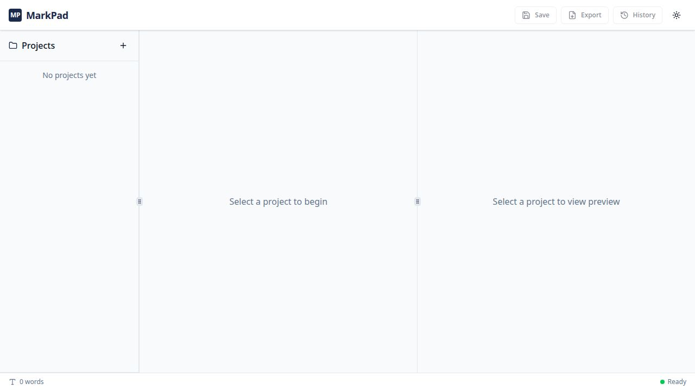

<div align="center">
	
</div>

# MarkPad

[](https://github.com/ahmadrazacdx/markpad/releases)
[](LICENSE)
[](https://github.com/ahmadrazacdx/markpad/releases)

*Overleaf For People Who Think In Markdown.*

I built this because writing LaTeX directly in Overleaf felt tedious for my day-to-day workflow.
I moved to Markdown + Pandoc in VS Code, but that became command-heavy very quickly, and previewing output meant constantly switching context.
I wanted one small, offline tool where I can write Markdown and see a live PDF preview in real time.

**MarkPad** is that tool.

## What This Repository Contains

1. **MarkPad**: a local-first desktop writing app (editor + project manager + live PDF preview + version control).
2. **MarkPDF**: a Markdown-to-PDF tool that opens as localhost browser tab.

The idea is simple: MarkPad for full writing workflow, MarkPDF for quick conversion jobs.
Detailed MarkPDF notes are in [artifacts/artifacts/markpdf-cli/README.md](artifacts/artifacts/markpdf-cli/README.md).

## What It Looks Like

<div align="center">
	
</div>

<div align="center">
	<p><em>MarkPDF UI screenshot placeholder (coming soon).</em></p>
</div>

## Core Behavior

- Write Markdown in a CodeMirror-based editor.
- Get live PDF preview through a local render pipeline.
- Organize writing into projects/files.
- Keep version history and restore past states.
- Export to PDF from a local/offline setup.

## Install (Windows)

1. Open [Releases](https://github.com/ahmadrazacdx/markpad/releases).
2. Download the latest MarkPad installer.
3. Run the installer and launch MarkPad.
4. Optional: install MarkPDF from the same release artifacts.

## Quick Start

### MarkPad (desktop app)

```bash
pnpm install
pnpm --filter @workspace/markpad run tauri:dev
```

### MarkPDF (CLI + localhost UI)

```bash
pnpm install
pnpm --filter @workspace/markpdf-cli run dev
```

If MarkPDF is installed globally on Windows, you can use:

```bash
markpdf --version
markpdf --help
markpdf
markpdf uninstall
```

### MarkPDF at a glance

- Accepts `.md` / `.markdown` files and project bundles.
- Supports folder upload or `.zip` upload workflows.
- Applies markdownlint-style auto-fixes for common formatting issues.
- Converts through Pandoc.
- Supports batch mode (up to 50 files).
- Returns a single PDF for one file, or a ZIP for batch output.

## Development

For web development of the editor + backend, run these in separate terminals:

```bash
cd artifacts/artifacts/api-server
PORT=8080 pnpm run dev
```

```bash
cd artifacts/artifacts/markpad
pnpm run dev
```

Note: in browser-based dev, keep API requests relative (`/api`) and use the Vite proxy.

## Build and Test

Workspace-level checks:

```bash
pnpm run typecheck
pnpm run test
pnpm run build
```

Windows desktop build:

```bash
pnpm --filter @workspace/markpad run tauri:build:windows
```

MarkPDF Windows CLI payload:

```bash
pnpm --filter @workspace/markpdf-cli run dist:win
```

## Stack

- Desktop shell: Tauri 2
- Frontend: React + Vite + CodeMirror
- Backend: Express + WebSocket
- Rendering: Pandoc + Typst
- Data: SQLite (libSQL) + Drizzle ORM

## Use Cases

- Writing papers, reports, or notes in Markdown while seeing PDF layout live.
- Running a local-first writing workflow that works fully offline.
- Managing multi-file writing projects with restorable version history.
- Converting single files or batches to PDF quickly with MarkPDF.
- Keeping source content clean in Markdown while exporting publication-ready PDFs.

## Contributing

We welcome contributions! Please see our [Contributing Guide](CONTRIBUTING.md) for details.

## License

Distributed under the terms of the [MIT license][license],
MarkPad is free and open source software.

## Issues & Support

If you encounter any problems:

- **[File an Issue](https://github.com/ahmadrazacdx/markpad/issues)**: Bug reports and feature requests
- **[Discussions](https://github.com/ahmadrazacdx/markpad/discussions)**: Questions and community support
- **[Documentation](https://github.com/ahmadrazacdx/markpad/tree/main/docs)**: Project docs and release notes

## AI Usage Disclosure

Parts of this project (code, docs, and release automation) are developed with AI assistance.
AI-assisted changes are reviewed and validated by the author before release.

---

<div align="center">
	
</div>

# MarkPad

[](https://github.com/ahmadrazacdx/markpad/releases)
[](LICENSE)
[](https://github.com/ahmadrazacdx/markpad/releases)

*Overleaf For People Who Think In Markdown.*

I built this because writing LaTeX directly in Overleaf felt tedious for my day-to-day workflow.
I moved to Markdown + Pandoc in VS Code, but that became command-heavy very quickly, and previewing output meant constantly switching context.
I wanted one small, offline tool where I can write Markdown and see a live PDF preview in real time.

**MarkPad** is that tool.

## What This Repository Contains

1. **MarkPad**: a local-first desktop writing app (editor + project manager + live PDF preview + version control).
2. **MarkPDF**: a Markdown-to-PDF tool that opens as localhost browser tab.

The idea is simple: MarkPad for full writing workflow, MarkPDF for quick conversion jobs.
Detailed MarkPDF notes are in [artifacts/artifacts/markpdf-cli/README.md](artifacts/artifacts/markpdf-cli/README.md).

## What It Looks Like

<div align="center">
	
</div>

<div align="center">
	<p><em>MarkPDF UI screenshot placeholder (coming soon).</em></p>
</div>

## Core Behavior

- Write Markdown in a CodeMirror-based editor.
- Get live PDF preview through a local render pipeline.
- Organize writing into projects/files.
- Keep version history and restore past states.
- Export to PDF from a local/offline setup.

## Install (Windows)

1. Open [Releases](https://github.com/ahmadrazacdx/markpad/releases).
2. Download the latest MarkPad installer.
3. Run the installer and launch MarkPad.
4. Optional: install MarkPDF from the same release artifacts.

## Quick Start

### MarkPad (desktop app)

```bash
pnpm install
pnpm --filter @workspace/markpad run tauri:dev
```

### MarkPDF (CLI + localhost UI)

```bash
pnpm install
pnpm --filter @workspace/markpdf-cli run dev
```

If MarkPDF is installed globally on Windows, you can use:

```bash
markpdf --version
markpdf --help
markpdf
markpdf uninstall
```
>**Note**: Open terminal in same folder where you install markpdf, otherwise it throws errors. (global behavior will be available soon.)

### MarkPDF at a glance

- Accepts `.md` / `.markdown` files and project bundles.
- Supports folder upload or `.zip` upload workflows.
- Applies markdownlint-style auto-fixes for common formatting issues.
- Converts through Pandoc.
- Supports batch mode (up to 50 files).
- Returns a single PDF for one file, or a ZIP for batch output.

## Development

For web development of the editor + backend, run these in separate terminals:

```bash
cd artifacts/artifacts/api-server
PORT=8080 pnpm run dev
```

```bash
cd artifacts/artifacts/markpad
pnpm run dev
```

Note: in browser-based dev, keep API requests relative (`/api`) and use the Vite proxy.

## Build and Test

Workspace-level checks:

```bash
pnpm run typecheck
pnpm run test
pnpm run build
```

Windows desktop build:

```bash
pnpm --filter @workspace/markpad run tauri:build:windows
```

MarkPDF Windows CLI payload:

```bash
pnpm --filter @workspace/markpdf-cli run dist:win
```

## Stack

- Desktop shell: Tauri 2
- Frontend: React + Vite + CodeMirror
- Backend: Express + WebSocket
- Rendering: Pandoc + Typst
- Data: SQLite (libSQL) + Drizzle ORM

## Use Cases

- Writing papers, reports, or notes in Markdown while seeing PDF layout live.
- Running a local-first writing workflow that works fully offline.
- Managing multi-file writing projects with restorable version history.
- Converting single files or batches to PDF quickly with MarkPDF.
- Keeping source content clean in Markdown while exporting publication-ready PDFs.

## Contributing

We welcome contributions! Please see our [Contributing Guide](CONTRIBUTING.md) for details.

## License

Distributed under the terms of the [MIT license][license],
MarkPad is free and open source software.

## Issues & Support

If you encounter any problems:

- **[File an Issue](https://github.com/ahmadrazacdx/markpad/issues)**: Bug reports and feature requests
- **[Discussions](https://github.com/ahmadrazacdx/markpad/discussions)**: Questions and community support
- **[Documentation](https://github.com/ahmadrazacdx/markpad/tree/main/docs)**: Project docs and release notes

## AI Usage Disclosure

Parts of this project (code, docs, and release automation) are developed with AI assistance.
AI-assisted changes are reviewed and validated by the author before release.

---

If you find the tools useful in your work, please give the repo a 🌟 and share with your friends.
